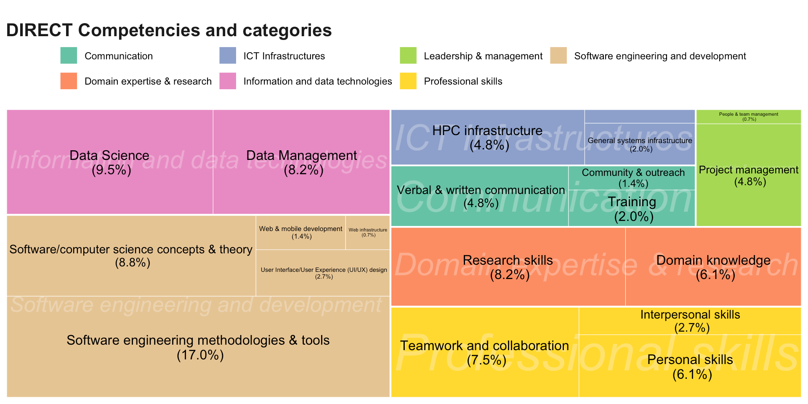

**Have you ever been involved in the training of any Digital Research Competency? If so, I am interested in knowing about your experience: what did you teach? To whom? How did you do it? What role did you play?** Beyond sheer, genuine curiosity, there’s a reason why I want to know about this and why I think others would benefit from this knowledge.

During the last decade, research has undergone a profound computational turn, as demonstrated by the proliferation of data-driven research (Crouch et al., 2013), the growing adoption of computational techniques across traditionally non-computational fields, such as social sciences and humanities, the increasing demand for Open Science and FAIR principles, and a new set of diverse academic outputs including software and datasets. The advent of AI has just accelerated this trend, while adding a new dimension of complexity.

As a result, navigating this evolving landscape requires mastering a wide range of skills and competencies — Digital Research Competencies (DRCs) as defined by the [DIRECT Framework](https://directframework.com/framework/skills_and_competencies/) — that need to be learnt and taught. Given their extensive specialised and technical backgrounds, Digital Research Technical Professionals (dRTPs) [^1] are well positioned to lead the delivery of that specialised training. At least in theory.

But what’s the reality of this training? How are dRTPs engaging with it? Are they leading or taking supportive roles? What added value do dRTPs bring to this essential component of research in comparison to other professionals or teaching platforms? These are some leading questions of “[Mapping and evaluating dRTP’s contributions to computing skills pedagogies in HE](https://warwick.ac.uk/fac/cross_fac/cim/research/projects/mapping-drtp-contributions/)”, the [DisCouRSE Network+](https://discourse-network.github.io/) funded project I’m leading with Timothy Monteath.

To answer them, we prepared a survey aimed at professionals involved in teaching DRC that asks two sets of questions: the first one about the respondent (role, career stage, etc.) and the second one about any training respondents have been involved with (context, role and capacity, contents, technologies involved and use of AI).

Preliminary results depict a landscape where most of the training is informal (i.e., it is not part of any degree or does not lead to an accreditation or certification), teaches a technology, software or programming language, and is aimed at PhD Students or Research Staff. This training is led by dRTPs (except when part of the curriculum, in which case dRTPs assume a support role) and provides Software Engineering and development skills, followed by Information and data technologies and professional skills (see figure below).

Of course, this is just an oversimplified summary and results are more extensive and nuanced (you can see a more detailed version in **[the slides for the talk I made at RSECon26](https://doi.org/10.5281/zenodo.22662428)**[^2]). At this stage, we are starting to analyse patterns based on job titles, career stage, training received or audience, and are incorporating more variables such as stance in relation to some statements or delivery mode.

Sadly, we have had a low response rate, so as useful as they are now, we would like to ask for your collaboration to better capture the landscape by filling out this anonymous survey (on average, it takes 6’ to respond) and distributing it to your colleagues before the 12th October.

The survey is aimed to anyone who has ever been involved in the delivery of training of any DRC in any capacity (we’ll be asking about that), regardless of their job title or career stage. Due to the demographics of our current responders, we are particularly welcoming “underrepresented” dRTPs such as Data Stewards, Librarians, PRISM, and Academics that would make results more diverse and meaningful for a wider audience.

> [!NOTE]
> This post was originally published at the [Institute for Research Software's blog](https://www.software.ac.uk/blog/how-do-drtps-contribute-teaching-digital-research-competencies).

[^2]: Please, do not check the slides until you’ve taken the survey or if you are not planning in doing it, as I would not want to condition your responses.